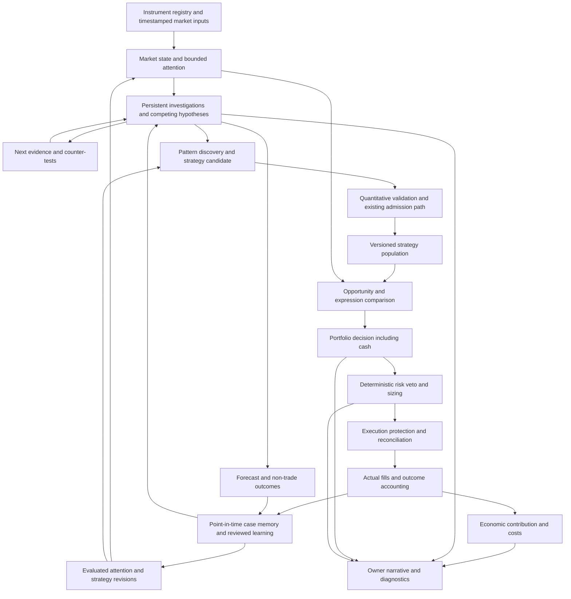

# Luffy delivery roadmap

Owner: Sarmad. Established: 2026-09-16. Scope: the complete owner goal, delivered
first on the existing crypto-futures demo system.

The [owner requirements](superpowers/specs/2026-09-16-luffy-end-goal.md) govern
this roadmap. This document describes the destination, architecture and delivery
sequence. The [delivery checklist](superpowers/plans/luffy-delivery-checklist.md)
is the single source of completion status. Start each session with
[NEXT_SESSION.md](NEXT_SESSION.md). Evidence belongs in dated reports.

## What exists and what the owner is still waiting for

Luffy currently trades through the existing strategy-led orchestrator. At the
[baseline review](superpowers/reports/2026-09-16-roadmap-baseline.md), its three
open journal positions belonged to Donchian Breakout Trail. The new attention
scanner and forward forecasts do not drive strategy creation or selection.
There is no validated better strategy delivered by the recent attention/recovery
work. Maturing its 16 price forecasts will not itself create adaptive intelligence.

Reusable code exists for market feeds, analysts, DSL strategies, quantitative
research, rolling admission/decay, portfolio evidence, execution, controls,
journalling and dashboards. Preserve useful components. Their existence does not
establish that the complete owner goal is connected or effective.

The next owner-visible capability is **M1: a continuing market investigation**.
It must identify what changed, distinguish facts from explanations, ask for
specific evidence, and revise its assessment when that evidence arrives. M2
then connects completed experience to later investigations; M3 and M4 connect
investigations to testable strategy candidates and measured admission decisions.
These are the critical path. Continue forward observation in the background.

## Final product acceptance

Engineering completion requires a replayable chain from market observations to
portfolio action and learning, with each transition carrying evidence and a
version. Luffy must demonstrate all of the following:

1. Discover accessible instruments; distinguish executable markets from observed
   references and explain missing/stale coverage.
2. Allocate bounded attention to unusual states and transitions across markets.
3. Maintain market/per-asset state and competing explanations, including unknown;
   preserve contradictions and identify what could distinguish the explanations.
4. Use point-in-time memory and quantitative pattern discovery to propose
   reproducible strategies and counter-tests, including failure conditions.
5. Test recent usefulness, costs, portfolio contribution and uncertainty before
   admission; reject or defer candidates without sufficient evidence.
6. Compare long, short, relative-value, hedge and cash expressions where supported;
   make portfolio decisions under unchanged deterministic risk authority.
7. Execute, reconcile and account for actual fills and protection through failures.
8. Learn from trades, skips, missed opportunities, errors and regime changes;
   version, evaluate and roll back proposed learning changes.
9. Explain decisions, contradictions, risk vetoes, outcomes, degradation and costs
   in owner-readable form with structured troubleshooting and replay evidence.
10. Assess rolling economic viability without forcing trades to cover expenses.

**Engineering completion and economic success are separate.** A complete system
can correctly conclude that it has no sufficient edge. Evidence of improved net
performance and of cost coverage requires an independently specified evaluation
and naturally arriving observations. Neither profit nor its timing is promised.
Real-money operation and expansion beyond the authorized demo scope need an
explicit owner scope decision; they are not implicit completion steps.

## Target architecture

No arrow from an explanation, an LLM probability, a raw outcome count or an
income target grants trading authority. Quantitative validation and deterministic
risk remain explicit boundaries. New intelligence integrates with the existing
strategy-spec creation/admission path; it does not create a parallel bypass.

### Component responsibilities

The owner's approximately 12–15 components are domains, not a required process
or model count. The deployment topology should stay as small as useful.

| Domain | Responsibility and allocation | Milestones |
|---|---|---|
| Market perception | Instrument metadata, provenance, freshness; deterministic ingestion | M0, M5 |
| Structure/auction | Structural state and transitions; quantitative features | M1, M3 |
| Flow/positioning | Funding, OI, flow/participation evidence; retain missingness | M1, M5 |
| Volatility | Compression/expansion and regime changes; quantitative/ML | M1, M3 |
| Global/cross-asset | Breadth, peers, macro and cross-market context | M1, M5 |
| Fundamental/on-chain | Timestamped catalysts and feasible new sources; bounded reasoning | M5 |
| World model | Versioned market/per-asset state and expected next states | M1 |
| Hypothesis engine and critic | Alternatives, contradictions, falsifiers, distinguishing tests | M1, M3 |
| Pattern discovery | States, sequences, interactions and failure patterns; quantitative/ML | M3 |
| Memory | Point-in-time cases and reusable cautions; no hindsight retrieval | M2 |
| Opportunity/expression | Compare payoff, instrument, hedge, short/long/pair/cash | M6 |
| Strategy researcher | Candidates, tests, admission evidence and lineage | M3, M4 |
| Portfolio/risk | Marginal risk, concentration, sizing and veto; deterministic authority | M6, M8 |
| Execution/reconciliation | Venue truth, protection, idempotence, fills and recovery | M0, M8 |
| Owner/economics | Narratives, costs, viability, control and service health | M9, M10 |

Fast safety/execution has no LLM dependency. Medium-horizon state/ranking uses
quantitative computation with bounded reasoning. Slow discovery/postmortems may
use ML and LLMs within measured budgets. LLM output is a proposal; probabilities
remain null or explicitly subjective until a measured calibration record exists.

### Contracts between components

These are target contracts, not declarations that the records already exist.
Prefer adapters around current IDs/schema to replacement stores.

| Record | Minimum meaning |
|---|---|
| Instrument/observation | Executability, source, event and observation time, availability, revision/version, missingness |
| State snapshot | Market and asset state, regime, context, transitions, evidence IDs and config/code versions |
| Investigation/update | Question, competing explanations, contradictions, expected consequences, invalidation, next test, previous/new assessment and rationale |
| Case memory | Inputs and versions, action/skip, outcome type, actual resolution time, causal uncertainty and retrieval reason |
| Candidate/experiment | Mechanical rule, universe, timeframe, mechanism claim, counter-test, costs, lineage and frozen evaluation protocol |
| Opportunity/portfolio decision | Eligible expressions, estimated cost/payoff and uncertainty, marginal risk, chosen action/cash and vetoes |
| Execution/outcome | Intent, order/fill/protection IDs, actual sizes/fees/funding, accounting completeness and estimates separated |
| Learning revision | Evidence provenance, proposed change, baseline comparison, validation result, deployed version and rollback |

## Delivery sequence and dependencies

Status is maintained only in the linked checklist. This table defines the plan.

| ID | Owner-visible result | Dependencies |
|---|---|---|
| M0 | Existing bounded observation and safety foundations | Existing system |
| M1 | Investigations change with newly available evidence | M0; current verified inputs |
| M2 | Earlier resolved cases inform later reasoning; trades and non-trades become usable memory | M1; exact outcome contracts |
| M3 | Observed patterns generate a mechanical strategy candidate and a counter-test | M1–M2; existing discovery/DSL tools |
| M4 | Candidate receives an honest comparative verdict and, only if qualified, enters the one admission path | M3; evidence safeguards; required accounting from M8 |
| M5 | Dynamic accessible universe and richer cross-market evidence | Incremental alongside M1–M4; no unsupported instrument assumptions |
| M6 | Choose expression and portfolio allocation rather than an isolated direction | M4; relevant M5 coverage; M8 for supported execution |
| M7 | Validated memory-driven revisions improve or appropriately leave unchanged attention and strategy selection | M2, M4; enough untouched evaluation evidence |
| M8 | Complete execution/fill attribution and recovery coverage for authorized expressions | Existing risk/execution; repair concrete safety blockers immediately |
| M9 | Honest rolling economic contribution and viability assessment | M8 accounting; M4/M6 evidence; owner cost inputs |
| M10 | Integrated autonomous demo acceptance, owner narrative, operations and controlled rollout | M1–M9 evidence |

M1–M4 are the main intelligence-to-strategy workstream. M5 extends only the inputs
needed for a specific investigation initially. M8 safety/accounting and M10 owner
visibility accompany the work where they are dependencies, rather than delaying
all intelligence until the infrastructure is exhaustive. A confirmed exposure
incident preempts feature work; routine monitoring improvements do not.

**Next implementation brief:** [M1 investigation plan](superpowers/plans/2026-09-16-market-investigation.md).
Do not create another high-level design before trying that bounded slice.

## Transition from legacy trading

1. Capture and freeze an honest comparator version of the current strategy-led
   behavior, including universe, sizing, costs and data availability. Its returns
   are a baseline to measure, not an assumed edge.
2. Run the new investigation/candidate chain beside it, with provenance and no
   new trading permission. Demonstrate meaningful changed assessments and concrete
   candidate rules before claiming an intelligence milestone.
3. Evaluate a frozen candidate and comparator with the same opportunity set,
   costs and predeclared chronological protocol. Record underpowered/rejected
   results and every attempted candidate; do not search a held-out window repeatedly.
4. Admit only through the existing authorized path and its current requirements.
   Preserve the recorded Gate 2 stop; a renamed experiment cannot evade it. If a
   required evaluation is prohibited or lacks untouched evidence, defer admission
   and continue permitted development/discovery.
5. After evidence and demo probation, migrate the relevant decision responsibility
   to the validated component, verify vetoes/rollback, and explicitly retire its
   superseded legacy branch. Prove the new component actually affects decisions.

The roadmap does not disable current strategies, alter existing positions, admit
a candidate, restart services, or authorize live-money trading by itself.

## Progress and change control

Each checklist item needs implementation, appropriate verification and a dated
artifact proving its stated acceptance. A milestone is complete only when all its
items are accepted. Record independently whether evidence is synthetic, offline,
demo-deployed, forward-observed or quantitatively validated. Passing tests is not
proof of prediction skill, and deployment is not proof of profitability.

Track counts of accepted scoped deliverables; do not turn them into a percentage
of trading intelligence, code effort or economic success. If an item proves too
large, split it with child IDs and preserve its history rather than silently
changing the denominator. Report elapsed/remaining engineering effort only when
there is measured evidence for an estimate. Observation time is a separate clock.

At session end update the checklist, dated evidence report and next-session block.
Reorder future tasks when evidence justifies it, recording why and the dependency
impact. Preserve completed artifacts. Owner requirements and current explicit
instructions outrank this delivery sequence.

## Owner requirement coverage

| Owner requirement section | Delivery coverage |
|---|---|
| 1 complete autonomous trader | M1–M10 integrated acceptance |
| 2 economic survival without forced trades | M9, M10 |
| 3 intelligence beyond fixed signals/LLM voting | M1–M4, M6–M7; migration acceptance |
| 4 accessible dynamic universe/cross-market relationships | M5, M6 |
| 5 attention allocation | M0, M1, M7 |
| 6 why this asset | M1, M5; causal uncertainty preserved |
| 7 investigation questions | M1–M3, M6 |
| 8 competing hypotheses | M1–M2, M7 calibration |
| 9 contradiction is informative | M1, M3, M6 |
| 10 world model | M1, M2, M5 |
| 11 automatic discovery including failures | M3, M7 |
| 12 surprise drives curiosity | M1, M3, M7 |
| 13 attention learns | M7 |
| 14 strategy emergence | M3–M4 |
| 15 evolving strategy population | M4, M7 |
| 16 direction and expression including cash | M6, M8 |
| 17 portfolio intelligence | M6 |
| 18 deterministic risk constitution | M0, M8, M10 |
| 19 specialized component domains | Component responsibility table above |
| 20 quantitative/ML/LLM allocation | Component table and architecture boundaries |
| 21 rich typed memory and doctrine proposals | M2, M7 |
| 22 learn from trades, skips, failures and surprises | M2, M7 |
| 23 fast/medium/slow horizons | M1 worker isolation; M8/M10 latency and budget acceptance |
| 24 economic survival brain | M9 |
| Acceptance A: owner narrative | M1, M6, M9, M10 |
| Acceptance B: structured diagnostics | M0 and every milestone; M10 full-chain audit |
| Acceptance C: replay and honesty | M1–M4, M7, M10 |
| Acceptance D: safety/hygiene | M0, M5, M8, M10 |
